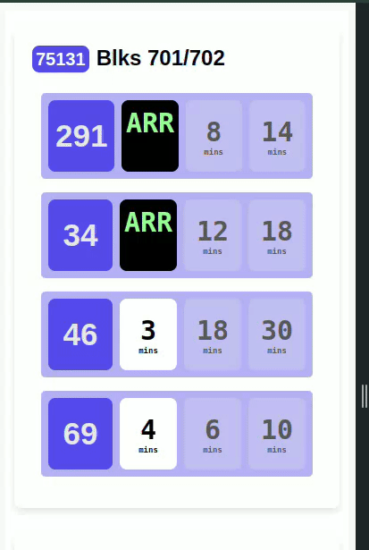

# SG Bus timing displays

Toy project / Personal Utility for accessing SBS bus timings easily from the web / phone. The server currently serves a list of hardcoded bus stations, that's tailored to the user's (me) preference.

This server is hosted on a DigitalOcean VPS. Pardon the poor code quality / commit practices in the repo!



## Starting the server
```
./run.sh
```

## Testing server endpoints
```
curl 127.0.0.1/bus
```

## TODO list
- Switch to typescript, just to learn typescript
- Allow dynamic bus stop addition / removal
- Make it work for all screen sizes (desktop to phone)
- Remove .env file after it's loaded
- FE should make single API call to BE instead of 1 call for each bus stop
- Typical CI/CD / unit-testing etc